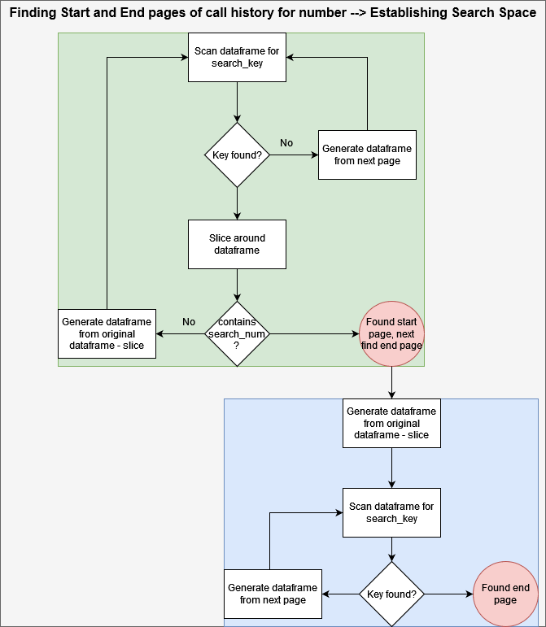
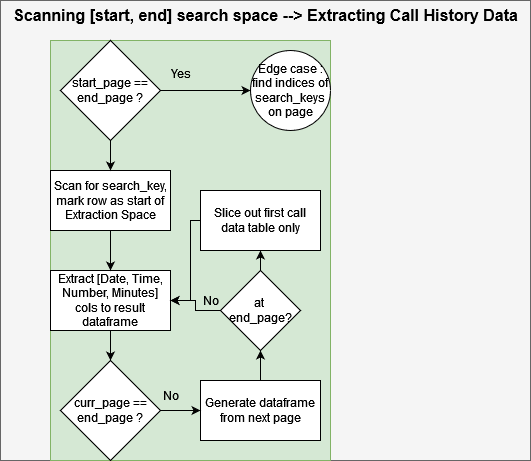
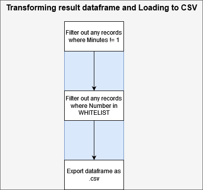

# parse-spammers-from-pdf-phone-bill
Parse the .pdf of your Verizon phone bill and export likely spam calls to a .csv

## Usage
Requires an installation of Java 8+ added to the $PATH, and Python 3.8+.
Developed and validated on Linux and Windows systems running Java8 and Python3.11

- `pip install -r requirements.txt`
- Download .pdf of phone bill and place in `input/` directory
- Configure pdf filename, search number, and whitelist in `.env`
  - Numbers in whitelist will not get exported to .csv
- Run `python main.py`
- Output .csv file placed in `output/` directory

## Design
The design has 3 main steps, each with an associated helper class in `src/helpers/`:
- Establish the search space of pages within the .pdf that contain call records for the search number
- Parse the search space to extract the call records
- Transform the resulting dataframe and export to .csv

To handle the edge case where call data for the search number begins in the middle of a page,
a guessing algorithm inspired by gradient descent was implemented. To prevent infinite loops,
an upper limit of 500 iterations is imposed, at which point a RuntimeError is raised. 

*Note: this is probably a sub-optimal solution, but it works for now without bloating the project
dependencies with a CV lib*

During the scanning process, some properties are collected for premature optimization, e.g. `end/start_page_key_index`

Search space flow:

Extract call records flow:

Transform and export flow:

